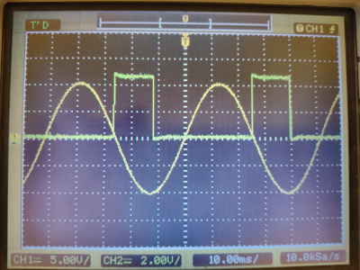

# bio semi triggerbox
Resettable audio trigger for use with biosemi. This device is used to synchronise audio events to trigger actions.

The trigger has three indicator LED's.
  - Red: When audio is received and all inputs of the paralel port (bits 0-7/pins 1-8) ar set 0, the red LED will turn on, and the BioSemi will detect bit 128 set to 1.
  - Green: When no audio is received and a trigger of bit 7 (bit 128) is given, the green LED is turned on and the BioSemi will detect bit 128 set to 0.
In case both a parallel trigger and a audio pulse are received simultaniously by the device the output is undetermined.
  - Yellow: When the sensor detects a signal, either audio or light.

# hardware

No software is used to prevent any delay. The device utilizes a [cd4027](https://www.ti.com/lit/ds/symlink/cd4027b-mil.pdf) for switching between states. 

The module switches when receiving a sinewave at or above the treshold of 1.5 volts. A phase angle of 90 degrees is caused by the capacitor. When exitating with 16khz, the period of the signal is ~63uS and the delay ~16uS. 

An example of 20hz.

